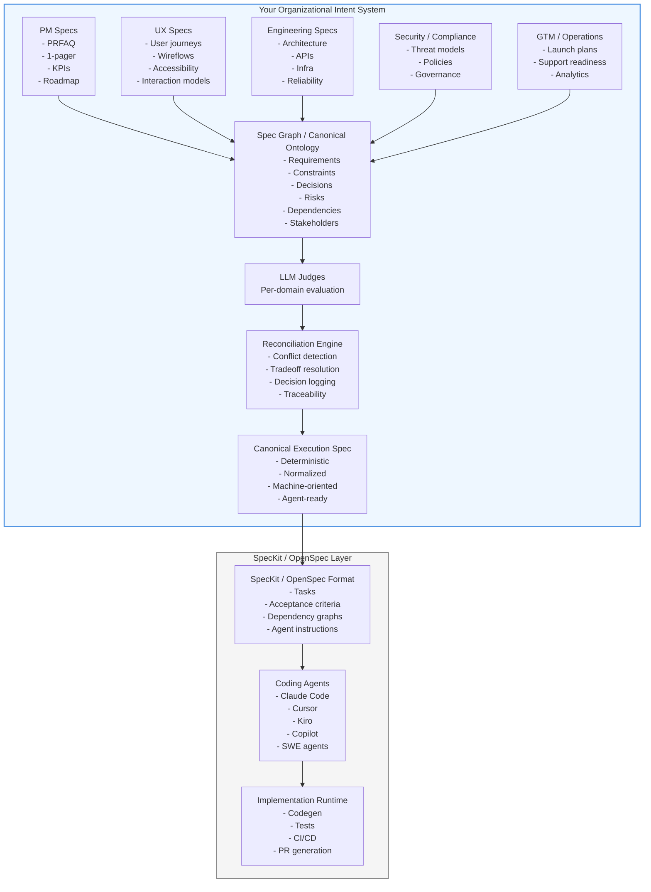
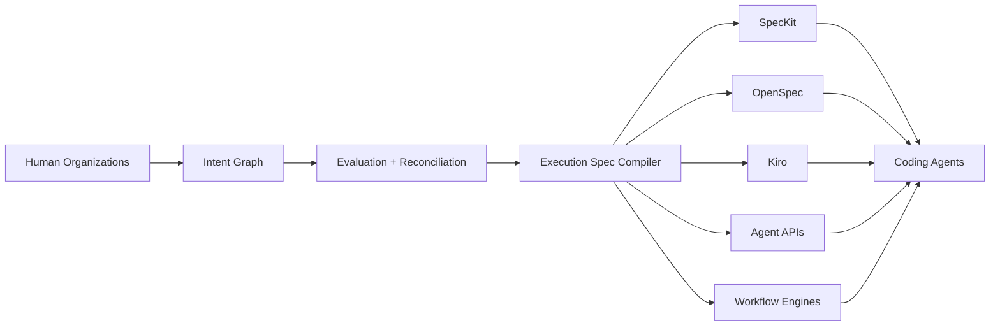

You should not copy GitHub Spec-Kit / Kiro / OpenSpec literally, and you also should not build a completely custom “everything from scratch” system.

The best architecture for a multi-team organization is:

1. **Adopt a compatible spec substrate**
2. **Add layered role-specific specs**
3. **Create orchestration + reconciliation workflows**
4. **Use evaluation/judging per domain**
5. **Generate an agent-consumable execution spec as the final artifact**

The key mistake many teams make is assuming there should be “one canonical spec” from the beginning. That works for solo builders. It breaks down organizationally once PM, UX, engineering, architecture, legal, GTM, and operations all become participants.

---

# The Core Difference: Solo-Agent Systems vs Organizational Systems

Systems like:

* GitHub
* Amazon-style workflows
* OpenAI-style specs
* Kiro-like IDE orchestration

are mostly optimized around:

* a single author,
* one evolving artifact,
* direct implementation by agents,
* low governance overhead,
* local optimization for coding velocity.

But enterprise product development is structurally different:

| Solo-agent workflow   | Multi-team organizational workflow |
| --------------------- | ---------------------------------- |
| One spec              | Multiple perspectives              |
| One user intent       | Conflicting constraints            |
| Fast iteration        | Governance + alignment             |
| “Good enough” specs   | Traceable decisions                |
| Direct implementation | Review gates                       |
| Prompt-centric        | Process-centric                    |
| Informal tradeoffs    | Explicit tradeoffs                 |

So if you directly copy Spec-Kit architectures, you will eventually discover:

* PM needs narrative artifacts
* UX needs flows and interaction contracts
* Engineering needs implementation constraints
* Security/legal/compliance need review surfaces
* GTM wants messaging artifacts
* Leadership wants decision rationale
* Agents need deterministic execution specs

These are fundamentally different representations.

---

# The Correct Mental Model

Do **not** think of “the spec.”

Think of:

# “A Spec Graph”

Where each node is:

* role-specific,
* reviewable,
* evaluatable,
* partially autonomous,
* linked by traceability.

Example:

```text
Market Problem Spec
    ↓
PR-FAQ / Narrative Spec
    ↓
Product Requirement Spec
    ↓
UX Interaction Spec
    ↓
System Architecture Spec
    ↓
API / Data Contract Spec
    ↓
Execution / Agent Task Spec
    ↓
Test / Evaluation Spec
```

This is much closer to how real organizations operate.

---

# Recommendation: Build a Layered Spec System

You want:

## Layer 1 — Shared Canonical Object Model

This is where alignment with Spec-Kit/OpenSpec matters.

Use:

* structured markdown,
* typed schemas,
* machine-readable sections,
* versioning,
* references,
* dependency graphs.

Example:

```yaml
feature_id:
stakeholders:
constraints:
acceptance_criteria:
dependencies:
risk_level:
decision_log:
```

This compatibility matters because:

* agents understand it,
* tools interoperate,
* ecosystem adoption becomes easier,
* future standards likely emerge here.

Do NOT invent completely novel formats unless necessary.

---

# Layer 2 — Team-Specific Specs

This is where most systems fail today.

You absolutely should separate:

* PM specs,
* UX specs,
* engineering specs,
* architecture specs,
* GTM specs,
* compliance/security specs.

Because each domain optimizes differently.

Example:

## PM spec optimizes:

* user value,
* business metrics,
* prioritization,
* market assumptions.

## UX spec optimizes:

* usability,
* flows,
* cognitive load,
* accessibility.

## Engineering spec optimizes:

* feasibility,
* scalability,
* latency,
* reliability.

These tensions are healthy.

If you force everyone into one document too early:

* nuance collapses,
* conflicts become implicit,
* reviews become chaotic,
* agents receive ambiguous instructions.

---

# So Should Teams Work Separately First?

Yes.

Strong recommendation:

# Diverge → Evaluate → Reconcile → Synthesize

NOT:

# “Everyone edits one mega-spec together”

---

# Recommended Workflow

## Phase 1 — Domain-Specific Authoring

Each team owns its own spec.

Example:

```text
PM:
- PRFAQ
- Business goals
- KPI definitions

UX:
- User journeys
- Interaction flows
- Accessibility

Engineering:
- Architecture
- APIs
- Infra constraints

Security:
- Threat model
- Compliance constraints
```

Each spec:

* independently versioned,
* independently reviewed,
* independently evaluated by LLM judges.

---

# Phase 2 — LLM-as-a-Judge Per Domain

This is extremely important.

A general-purpose “single evaluator” becomes weak quickly.

Instead:

| Spec Type            | Judge Type                     |
| -------------------- | ------------------------------ |
| PM spec              | business-value judge           |
| UX spec              | usability/accessibility judge  |
| Engineering spec     | feasibility/reliability judge  |
| Security spec        | threat/compliance judge        |
| Agent execution spec | determinism/completeness judge |

This mirrors human specialization.

The biggest insight:

# evaluation criteria should differ by organizational role.

---

# Phase 3 — Reconciliation Layer

Now create:

# a synthesis/reconciliation engine

Its job:

* detect conflicts,
* identify missing assumptions,
* merge constraints,
* create traceability,
* escalate unresolved tradeoffs.

Example conflicts:

* PM wants onboarding in 1 click
* Security requires MFA
* UX wants fewer interruptions
* Engineering says latency budget exceeded

This should not be hidden.
This should become:

* explicit tradeoff records,
* decision logs,
* rationale graphs.

This layer becomes enormously valuable organizationally.

---

# Phase 4 — Final Agent Execution Spec

Only at the end should you generate:

# “the implementation spec”

This is:

* concise,
* deterministic,
* normalized,
* machine-oriented,
* conflict-resolved.

This is what coding agents consume.

---

# Why Single-Spec Iteration Fails Organizationally

Single evolving specs create several problems:

## 1. Local edits break other domains

Example:
PM updates a KPI requirement.
Engineering implications silently change.

## 2. Review ownership becomes unclear

Who approves:

* UX?
* architecture?
* compliance?

## 3. Agents lose provenance

The agent cannot tell:

* hard requirement vs suggestion,
* approved decision vs unresolved debate.

## 4. Organizational memory disappears

Decision rationale matters enormously at scale.

---

# The Better Architecture

What you probably want is:

```text
                    ┌─────────────────┐
                    │ Shared Ontology │
                    └────────┬────────┘
                             │
       ┌─────────────────────┼─────────────────────┐
       │                     │                     │
┌─────────────┐      ┌─────────────┐      ┌─────────────┐
│ PM Spec     │      │ UX Spec     │      │ Eng Spec    │
└─────┬───────┘      └─────┬───────┘      └─────┬───────┘
      │                    │                    │
      ▼                    ▼                    ▼
 PM Judge             UX Judge             Eng Judge
      │                    │                    │
      └────────────────────┼────────────────────┘
                           ▼
                 Reconciliation Layer
                           ▼
                 Canonical Execution Spec
                           ▼
                    Coding Agents
```

This scales dramatically better.

---

# Where Spec-Kit/OpenSpec Still Matter

You should absolutely remain aligned with emerging ecosystems for:

## 1. Interoperability

You want:

* IDE compatibility,
* agent portability,
* MCP integrations,
* future ecosystem tooling.

## 2. Agent Expectations

Agents increasingly expect:

* structured acceptance criteria,
* constraints,
* tasks,
* dependency graphs.

## 3. Future Standards

There will likely be:

* “OpenAPI for software intent”
* standardized spec ontologies
* agent execution contracts

You want compatibility.

---

# But Do NOT Copy Their Assumptions

Most current systems assume:

* one human,
* one repo,
* one evolving spec,
* engineering-first workflows.

You are talking about:

# organizational intent orchestration.

That is a different category.

---

# The Most Important Architectural Decision

The most important thing is NOT:

* markdown format,
* templates,
* agent framework.

It is this:

# “Where do conflicts live?”

If conflicts are hidden inside one evolving doc:

* organizational entropy increases.

If conflicts become first-class structured artifacts:

* agents become dramatically more reliable,
* reviews become scalable,
* governance improves,
* execution quality rises.

---

# My Recommendation

## Build:

### 1. Shared structured spec substrate

Compatible with Spec-Kit/OpenSpec ideas.

### 2. Separate role-specific specs

PM, UX, engineering, security, GTM.

### 3. Domain-specific LLM judges

Per-spec evaluation systems.

### 4. Reconciliation/orchestration layer

This becomes your moat.

### 5. Final normalized execution spec

Optimized for coding agents.

---

# Strategic Insight

The long-term winning systems likely will NOT be:

* “AI coding IDEs”

They will be:

# organizational intent operating systems

The hard problem is no longer code generation.

It is:

* aligning organizational intent,
* resolving tradeoffs,
* preserving rationale,
* generating executable clarity.

That is the next abstraction layer above coding copilots.

===

Yes — but the CLI should *not* be your primary product.

You should build:

# an orchestration/meta-CLI

that can:

* interoperate with Spec-Kit/OpenSpec/Kiro-style workflows,
* manage multi-team spec graphs,
* run evaluation pipelines,
* reconcile specs,
* generate execution specs,
* coordinate agents.

In other words:

> Don’t build “another spec CLI.”
> Build the control plane above spec CLIs.

That distinction matters enormously.

---

# Why You Probably Need Your Own CLI

If your system introduces:

* multiple roles,
* layered specs,
* governance,
* evaluation,
* reconciliation,
* organizational workflows,

then existing CLIs are too low-level.

Current CLIs mostly optimize for:

* local repo workflows,
* solo builders,
* developer ergonomics,
* code generation pipelines.

You are describing:

# organizational specification orchestration.

That requires additional primitives.

---

# Recommended Architecture

Do NOT fork their systems deeply.

Instead:

```text id="9g2qta"
Your Orchestrator CLI
        │
        ├── Adapters
        │     ├── Spec-Kit
        │     ├── OpenSpec
        │     ├── Kiro
        │     └── Internal formats
        │
        ├── Evaluation Engine
        ├── Reconciliation Engine
        ├── Workflow Engine
        ├── Approval Engine
        └── Agent Runtime
```

This is much more future-proof.

---

# Why a Meta-CLI Is Better Than Building a Full Competing CLI

If you create:

# “Yet Another Spec Format + CLI”

you inherit:

* ecosystem fragmentation,
* migration friction,
* compatibility maintenance,
* agent incompatibilities,
* standards risk.

You do *not* want to fight:

* GitHub,
* IDE vendors,
* agent framework ecosystems,
* emerging spec standards.

Instead:

# absorb and orchestrate them.

That gives you leverage.

---

# The Winning Abstraction Is NOT the Spec

This is the key strategic insight.

Spec formats are likely to commoditize.

What becomes valuable is:

* orchestration,
* evaluation,
* traceability,
* governance,
* multi-agent coordination,
* organizational memory,
* reconciliation.

Your moat is:

# “How organizations converge intent into executable systems.”

Not:

# “our markdown schema is better.”

---

# What Your CLI Should Actually Do

Your CLI should operate at a higher abstraction layer.

Example:

```bash id="b0i9jv"
orgspec init
orgspec ingest spec-kit
orgspec create pm-spec
orgspec create ux-spec
orgspec evaluate ux-spec
orgspec reconcile
orgspec approve
orgspec synthesize
orgspec generate-execution-spec
orgspec dispatch-to-agents
```

Notice:

* these are organizational verbs,
* not codegen verbs.

That’s the distinction.

---

# Recommended Design Pattern: Adapter Architecture

Build adapters like:

```text id="26slmq"
Adapter Interface
    ├── import_spec()
    ├── export_spec()
    ├── validate()
    ├── normalize()
    └── generate_tasks()
```

Then support:

* Spec-Kit
* OpenSpec
* Kiro
* custom YAML/JSON
* Jira/Linear/Notion ingestion
* PR-FAQ docs
* Figma metadata
* architecture docs

This becomes extremely powerful.

---

# Your Internal Canonical Model Matters More Than External Formats

Externally:

* support multiple ecosystems.

Internally:

* maintain your own canonical ontology/spec graph.

Example:

```yaml id="mxfx4y"
intent:
requirements:
constraints:
stakeholders:
decisions:
risks:
dependencies:
evaluations:
approvals:
execution_tasks:
traceability:
```

The CLI becomes:

# a compiler/orchestrator for organizational intent.

---

# Important: Separate “Authoring UX” From “Canonical Representation”

One huge mistake:
teams assume there should be:

* one format,
* one editing workflow,
* one UI.

Instead:

| Team         | Preferred Medium           |
| ------------ | -------------------------- |
| PM           | PRFAQ / docs               |
| UX           | flows + annotations        |
| Engineering  | structured specs           |
| Architecture | ADRs                       |
| Execs        | summaries                  |
| Agents       | normalized execution specs |

Your system should:

* ingest all,
* normalize all,
* trace all.

This is why orchestration matters more than spec syntax.

---

# Should the CLI Wrap Existing CLIs?

Usually:

# yes, indirectly.

There are three good models:

## Option A — Shell Wrapper

```bash id="9h0z6l"
orgspec import spec-kit
```

Internally invokes:

* spec-kit CLI,
* parses outputs,
* normalizes artifacts.

Fastest path.
Weakest integration.

---

## Option B — SDK/Library Integration

Use their internal libraries/APIs where possible.

Better:

* type safety,
* stability,
* richer metadata.

Harder initially.
Better long-term.

---

## Option C — Native Parsers

Directly parse:

* markdown,
* YAML,
* JSON schemas.

Most robust long-term.

Probably inevitable eventually.

---

# Recommended Strategy

## Short-Term

Build:

* lightweight orchestration CLI,
* adapters,
* import/export,
* evaluation pipelines.

Do NOT overbuild authoring.

Leverage existing ecosystems.

---

## Medium-Term

Add:

* reconciliation workflows,
* approval systems,
* traceability graphs,
* organizational memory,
* role-aware evaluations.

This is where differentiation emerges.

---

## Long-Term

Your CLI likely becomes:

# an “organizational compiler”

Inputs:

* PM docs,
* UX flows,
* architecture constraints,
* policies,
* codebase context.

Outputs:

* executable agent plans,
* governance artifacts,
* implementation graphs,
* deployment workflows,
* audit trails.

That’s substantially larger than a spec CLI.

---

# Important Organizational Insight

Most organizations do *not* actually suffer from:

* inability to write specs.

They suffer from:

* inconsistent intent,
* unresolved tradeoffs,
* fragmented decision-making,
* loss of rationale,
* weak execution traceability.

Your system should optimize for those problems.

---

# Strong Recommendation

Build:

* your own orchestration CLI,
* your own canonical graph model,
* your own evaluation/reconciliation pipeline,

BUT:

* remain interoperable with Spec-Kit/OpenSpec/Kiro ecosystems,
* avoid ecosystem isolation,
* avoid inventing unnecessarily incompatible standards.

That gives you:

* ecosystem leverage,
* future flexibility,
* organizational differentiation,
* lower adoption friction.

===

Yes — but only at the *final execution layer*.

You generally want:

# Multiple human-facing specs

→ reconciled into

# One machine-facing execution spec

That execution spec can then be exported into:

* GitHub-compatible structures,
* OpenAI formats,
* Kiro-style execution plans,
* coding-agent task graphs.

The critical insight is:

# Humans should not collaborate primarily through the final AI execution spec.

That artifact should be:

* synthesized,
* normalized,
* conflict-resolved,
* deterministic,
* implementation-oriented.

Trying to make:

* PM,
* UX,
* architecture,
* security,
* engineering,
  all directly co-edit the same implementation-oriented spec creates organizational entropy.

---

# The Correct Architecture

Think of this as:

# “Compilation”

Like software compilation:

```text id="uk9eg1"
Human Intent Layers
    ↓
Domain Specs
    ↓
Evaluation
    ↓
Reconciliation
    ↓
Canonical Org Spec Graph
    ↓
Execution Spec Compiler
    ↓
SpecKit/OpenSpec Output
    ↓
Coding Agents
```

The important thing:

# SpecKit/OpenSpec become target runtimes.

Not necessarily your system of record.

That distinction is strategically important.

---

# Why This Matters

SpecKit/OpenSpec-style systems are optimized for:

* execution,
* implementation,
* task decomposition,
* coding agents.

But organizations operate in:

* ambiguity,
* negotiation,
* tradeoffs,
* evolving priorities.

Those are different optimization problems.

---

# You Want Two Different Kinds of Specs

## 1. Organizational Intent Specs (Human-Oriented)

These are:

* rich,
* contextual,
* debatable,
* role-specific,
* partially conflicting.

Examples:

* PR-FAQ
* UX rationale
* architecture ADRs
* risk analysis
* compliance reviews

These should preserve:

* rationale,
* uncertainty,
* alternatives,
* stakeholder ownership.

---

## 2. Execution Specs (Agent-Oriented)

These should be:

* deterministic,
* concise,
* normalized,
* dependency-aware,
* implementation-ready.

This is where SpecKit/OpenSpec fit best.

---

# Why Not One Unified Spec From the Beginning?

Because humans and agents need different properties.

| Humans Need        | Agents Need           |
| ------------------ | --------------------- |
| nuance             | precision             |
| rationale          | determinism           |
| alternatives       | resolved decisions    |
| debate             | constraints           |
| ambiguity handling | explicit instructions |
| tradeoffs          | executable tasks      |

One artifact is bad at serving both simultaneously.

---

# The Better Model

Your system should act like:

# “An Organizational Intent Compiler”

Inputs:

* PM docs
* UX specs
* architecture
* security policies
* analytics goals
* operational constraints

Compiler stages:

* normalization
* conflict detection
* reconciliation
* scoring
* traceability
* synthesis

Outputs:

* execution-ready specs
* agent plans
* evaluation suites
* deployment workflows

---

# The Key Architectural Decision

Do NOT make SpecKit/OpenSpec:

# your source of truth.

Make them:

# execution targets.

That gives you:

* flexibility,
* ecosystem compatibility,
* future portability,
* abstraction control.

---

# Recommended Canonical Pipeline

## Stage 1 — Team Specs

Separate artifacts:

```text id="gqz5a4"
/pm
/ux
/engineering
/security
/gtm
/legal
```

---

## Stage 2 — Evaluation

Each spec evaluated independently.

Example:

* UX completeness judge
* architecture feasibility judge
* PM coherence judge
* compliance judge

---

## Stage 3 — Reconciliation Graph

Store:

* conflicts,
* dependencies,
* assumptions,
* unresolved decisions,
* approvals.

This becomes:

# the organizational memory layer.

Very valuable.

---

## Stage 4 — Canonical Org Spec Graph

This is your internal representation.

NOT markdown-centric.

Likely graph-oriented.

Example nodes:

* goals
* actors
* requirements
* constraints
* decisions
* risks
* tasks

Edges:

* depends_on
* conflicts_with
* derived_from
* approved_by
* blocks
* supersedes

This becomes your real moat.

---

# Stage 5 — Execution Spec Generation

Now generate:

* SpecKit format
* OpenSpec format
* Kiro tasks
* coding-agent prompts
* CI workflows
* test plans

At this point:

* ambiguity should be mostly resolved,
* tradeoffs documented,
* priorities explicit.

---

# Important Insight

The final execution spec should probably be:

# smaller than the combined human specs.

Not larger.

Because synthesis should:

* collapse ambiguity,
* resolve conflicts,
* remove narrative overhead,
* normalize terminology.

---

# Example

## Human Layer

PM says:

> “Onboarding must feel instant.”

Security says:

> “MFA required for all enterprise users.”

UX says:

> “Avoid interruptive auth.”

Engineering says:

> “Session bootstrap takes 3 seconds.”

---

## Reconciliation Layer

Produces:

```yaml id="v4xg9y"
decision:
  onboarding_strategy: progressive_authentication

constraints:
  - MFA required before privileged actions
  - anonymous exploration allowed

latency_budget:
  initial_load: <1.5s

accepted_tradeoff:
  enterprise users encounter delayed MFA challenge
```

---

## Final Execution Spec

```yaml id="4s1frn"
task:
  implement_progressive_auth

requirements:
  - allow anonymous session
  - defer MFA until privileged action
  - preload enterprise claims async

tests:
  - MFA enforced before write actions
  - anonymous browsing enabled
```

That’s what agents should consume.

Not the organizational debate.

---

# Strong Recommendation

## YES:

Generate a unified execution spec.

## NO:

Do not force all teams to collaborate directly inside that final execution artifact.

---

# The Best Long-Term Architecture

Your system becomes:

```text id="73trvw"
Organization
    ↓
Intent Graph
    ↓
Reconciliation Engine
    ↓
Execution Compiler
    ↓
SpecKit/OpenSpec/Kiro
    ↓
Coding Agents
```

This is much more scalable than:

# “everyone edits one giant markdown spec.”

Because the hard problem is not:

* generating code.

It is:

* converting organizational intent into executable clarity.

===



The important architectural distinction is:

| Your System                  | SpecKit / OpenSpec       |
| ---------------------------- | ------------------------ |
| Organizational intent system | Execution/runtime system |
| Multi-team coordination      | Agent implementation     |
| Human ambiguity              | Machine determinism      |
| Reconciliation               | Task decomposition       |
| Governance                   | Code generation          |
| Decision traceability        | Execution workflows      |

So:

# SpecKit/OpenSpec should sit downstream of your orchestration layer.

---

# Which Should Be the First Target?

I would strongly recommend:

# SpecKit first

and treat OpenSpec as a secondary/export target initially.

---

# Why SpecKit Is the Better First Target

## 1. More Execution-Oriented

SpecKit is closer to:

* implementation planning,
* coding workflows,
* task decomposition,
* repo execution,
* engineering handoff.

That aligns well with:

# your “execution spec compiler” layer.

---

## 2. Better Mapping From Reconciled Specs

Your synthesized execution spec likely maps naturally to:

* tasks,
* acceptance criteria,
* dependencies,
* implementation phases.

SpecKit’s structure is relatively compatible with this.

---

## 3. Easier Incremental Adoption

Engineering teams can adopt:

* generated SpecKit outputs,
  without changing:
* PM workflows,
* UX workflows,
* organizational processes.

This lowers friction dramatically.

---

# Why OpenSpec Is Still Important

OpenSpec is strategically important because it points toward:

* interoperable spec ecosystems,
* agent portability,
* shared ontologies,
* standardization.

But today, many OpenSpec-like systems are still:

* more conceptual,
* less operationally standardized,
* less workflow-concrete.

So OpenSpec is valuable as:

# a canonical interchange/export layer.

But probably not your first operational integration.

---

# Recommended Sequencing

## Phase 1 — Internal Canonical Graph

Build:

* ontology,
* reconciliation,
* evaluations,
* traceability.

Do NOT over-optimize external formats yet.

---

## Phase 2 — SpecKit Export

Generate:

* implementation tasks,
* acceptance criteria,
* dependency DAGs,
* coding-agent workflows.

This gives immediate engineering value.

---

## Phase 3 — OpenSpec Export

Add:

* standardized interchange,
* ecosystem interoperability,
* multi-agent portability.

This is likely strategically important long-term.

---

# Important Strategic Insight

Your real moat is probably NOT:

* the final execution spec format.

It is:

# the transformation pipeline.

SpecKit/OpenSpec are:

# execution targets.

Your value is:

* organizational reconciliation,
* intent normalization,
* decision traceability,
* multi-role synthesis,
* evaluation orchestration.

That layer is substantially harder than:

* markdown schemas,
* task generators,
* coding agent wrappers.

---

# The Long-Term Architecture Likely Looks Like This



That architecture keeps you:

* ecosystem-compatible,
* future-flexible,
* organizationally differentiated,
* resilient to changing agent frameworks.

===

# Recommendation

Use:

# **TeamSpec**

NOT:

* TeamSDD
* Team-SDD
* Team Spec-Driven Design

---

# Why “TeamSpec” Is Better

## 1. Simpler Mental Model

“Spec” is already becoming the dominant abstraction:

* SpecKit
* OpenSpec
* specs-driven workflows
* agent specs
* implementation specs

“SDD” is still overloaded and ambiguous:

* software design document
* spec-driven development
* schema-driven design
* system design doc

You would constantly explain it.

“TeamSpec” is immediately understandable:

> collaborative specs for teams.

That clarity matters enormously.

---

# 2. Broader Than Development

Your system is not just:

* development methodology,
* software design,
* engineering process.

It includes:

* PM,
* UX,
* GTM,
* compliance,
* organizational alignment,
* reconciliation,
* governance.

“TeamSpec” naturally encompasses this broader scope.

“TeamSDD” sounds engineering-centric.

---

# 3. Better Product Architecture Naming

You can create a cleaner ecosystem:

| Layer             | Naming            |
| ----------------- | ----------------- |
| Core platform     | TeamSpec          |
| Canonical graph   | TeamSpec Graph    |
| Pipeline          | TeamSpec Pipeline |
| Evaluator         | TeamSpec Judge    |
| Reconciliation    | TeamSpec Resolve  |
| CLI               | `teamspec`        |
| Config            | `teamspec.yaml`   |
| Project directory | `.teamspec/`      |

This becomes cohesive very quickly.

---

# 4. Better Positioning Against SpecKit/OpenSpec

You do NOT want to sound like:

* another implementation framework,
* another coding IDE,
* another dev workflow.

You want to sound like:

# the organizational orchestration layer above them.

“TeamSpec” communicates that much better.

---

# 5. Easier Future Expansion

You may eventually support:

* non-software projects,
* operations,
* AI governance,
* enterprise workflows,
* hardware,
* research.

“TeamSpec” scales naturally.

“SDD” becomes limiting.

---

# Strong Naming Architecture Recommendation

## Product

# TeamSpec

---

## CLI

```bash id="p1f5kr"
teamspec init
teamspec validate
teamspec reconcile
teamspec evaluate
teamspec synthesize
teamspec export spec-kit
```

---

## Internal Concepts

| Concept               | Suggested Name   |
| --------------------- | ---------------- |
| Canonical graph       | SpecGraph        |
| Reconciliation engine | Resolve          |
| Evaluation engine     | Judge            |
| Final compiler        | Synthesize       |
| Output package        | Execution Bundle |
| Traceability system   | Lineage          |
| Quality gates         | Policy Gates     |

---

# Alternative Names Worth Considering

If you want something more category-defining:

| Name       | Positioning             |
| ---------- | ----------------------- |
| TeamSpec   | safest/best overall     |
| SpecGraph  | more technical          |
| IntentOS   | ambitious/platform-y    |
| OrgSpec    | enterprise/governance   |
| AlignSpec  | alignment-focused       |
| Consensus  | collaboration-centric   |
| IntentFlow | workflow-centric        |
| SpecFlow   | execution-centric       |
| MultiSpec  | descriptive but generic |

But:

# TeamSpec is probably the strongest practical choice.

It’s:

* memorable,
* broad,
* extensible,
* easy to explain,
* ecosystem-compatible,
* productizable.

===

You should support:

* PRD
* MRD
* TRD
* UXD
* ADR
* PRFAQ
* etc.

But I would strongly avoid making the *product identity* tied to those document types.

So:

# TeamSpec as the platform

with

# domain-specific spec types underneath

is likely the best structure.

---

# Why This Matters

Your core insight is not:

> “multiple humans collaborate”

because yes, one human could technically write:

* PRD
* MRD
* TRD
* UX specs

Your deeper insight is:

# “different domains produce different kinds of intent.”

That remains true whether:

* 1 person writes them,
* or 50 people do.

So your architecture should optimize for:

# domain separation

not necessarily

# human separation.

That’s a very important distinction.

---

# Recommended Conceptual Model

## Platform Layer

# TeamSpec

The orchestration system.

Handles:

* evaluation,
* reconciliation,
* traceability,
* synthesis,
* export,
* governance.

---

## Domain Spec Types

Examples:

| Spec Type | Purpose                |
| --------- | ---------------------- |
| MRD       | market requirements    |
| PRD       | product requirements   |
| UXD       | experience design      |
| TRD       | technical requirements |
| ADR       | architecture decisions |
| SEC       | security/compliance    |
| GTM       | launch/marketing       |
| OPS       | operational readiness  |

These become:

# typed intent artifacts.

---

# The Important Architectural Shift

Most existing systems are:

# document-centric

You should be:

# intent-centric

Example:

Instead of:

```text id="c2d3pz"
PRD.md
TRD.md
UXD.md
```

internally think:

```yaml id="h5pkzn"
intent_nodes:
  - requirement
  - business_goal
  - ux_constraint
  - technical_constraint
  - dependency
  - risk
  - decision
  - assumption
```

Then:

* PRD,
* TRD,
* MRD,
  become:

# projections/views over the graph.

This is a much more scalable architecture.

---

# Why “TeamPRD” or “TeamSDD” Is Too Narrow

If you tie branding to:

* PRD,
* SDD,
* TRD,

you risk:

* document-centric thinking,
* engineering-centric positioning,
* reduced extensibility.

But your system is bigger than:

# “better PRDs.”

It’s really:

# organizational intent orchestration.

---

# Better Framing

Think of this as:

```text id="p8ptnq"
Domain Specs
    ↓
Intent Graph
    ↓
Evaluation
    ↓
Reconciliation
    ↓
Canonical Execution Spec
```

NOT:

```text id="6cv3u9"
PRD → Code
```

That distinction becomes your moat.

---

# Recommended Naming Structure

## Product

# TeamSpec

---

## Domain Specs

Examples:

```text id="e6grlm"
teamspec/
  mrd/
  prd/
  uxd/
  trd/
  adr/
  sec/
  gtm/
```

or:

```yaml id="b47r8r"
spec_type: prd
spec_type: trd
spec_type: mrd
```

---

# This Gives You Flexibility

A solo founder can:

* write all domains themselves.

An enterprise can:

* assign ownership by team.

Same architecture.
Same reconciliation pipeline.

That’s ideal.

---

# Important Product Insight

You should probably think of your system as:

# “Git for organizational intent”

or

# “CI/CD for specifications”

NOT:

# “a PRD tool.”

Because the real value emerges from:

* consistency,
* reconciliation,
* dependency analysis,
* governance,
* evaluation,
* traceability.

Not from document editing.

---

# The Best Long-Term Positioning

## TeamSpec

### “Multi-domain specification orchestration for humans and AI agents.”

Then:

* PRD
* MRD
* TRD
* UXD
* ADR
* PRFAQ

are all:

# first-class spec domains inside the system.

That scales much better than anchoring the product identity around one document category.

===

I think your intuition is correct:

# the name should describe multiplicity of intent/domains

not necessarily multiplicity of humans.

Because:

* one human may author many domain specs,
* many humans may author one domain collaboratively,
* AI agents may own/review specs,
* future workflows may be mostly autonomous.

So anchoring too strongly on “team” may eventually feel limiting.

---

# Comparing the Naming Directions

| Name             | Strength                     | Weakness              |
| ---------------- | ---------------------------- | --------------------- |
| TeamSpec         | approachable, organizational | implies humans/teams  |
| MultiSpec        | domain multiplicity          | slightly generic      |
| SpecGraph        | technically strong           | less product-friendly |
| OrgSpec          | enterprise/governance        | less flexible         |
| IntentOS         | ambitious/platform-level     | abstract              |
| SpecFlow         | execution/workflow feel      | narrower              |
| PolySpec         | interesting technically      | less intuitive        |
| MetaSpec         | orchestration feel           | overloaded term       |
| OmniSpec         | broad coverage               | sounds buzzwordy      |
| MultiDomain Spec | descriptive                  | not brandable         |

---

# The Core Concept You’re Actually Naming

You are naming a system for:

```text id="qjv6rp"
Multiple Intent Domains
        +
Evaluation
        +
Reconciliation
        +
Canonical Synthesis
        +
Agent Execution
```

NOT:

* document editing,
* teams,
* coding,
* PM only,
* PRDs only.

So the strongest names will imply:

* multiplicity,
* orchestration,
* synthesis,
* specifications,
* domains,
* intent.

---

# Why “MultiSpec” Is Actually Strong

The more I think about it:

# MultiSpec is quite good.

Because it naturally supports:

| Scenario            | Interpretation                 |
| ------------------- | ------------------------------ |
| One human           | multiple spec domains          |
| Many humans         | multiple contributors          |
| Human + agents      | multiple actors                |
| Enterprise          | multiple organizations/domains |
| Future AI workflows | multiple autonomous specs      |

And importantly:

# “multi” modifies the specifications themselves,

not the humans.

That’s architecturally closer to your real insight.

---

# TeamSpec vs MultiSpec

## TeamSpec communicates:

> collaborative organizational workflows

Good for:

* enterprise positioning,
* PM/UX/Eng alignment,
* governance,
* workflow orchestration.

Potential downside:

* sounds human-centric.

---

## MultiSpec communicates:

> multiple coordinated specification domains

Good for:

* graph/reconciliation architecture,
* agent-native systems,
* solo + enterprise support,
* future AI workflows,
* technical flexibility.

Potential downside:

* slightly more abstract initially.

---

# I Think the Real Question Is:

Do you want the identity to emphasize:

## collaboration

or

## compositional specification architecture?

---

# My Read Based on Your Architecture

Your system is fundamentally about:

# compositional intent systems.

Meaning:

* many specs,
* many domains,
* many evaluators,
* many reconciliations,
* many outputs.

That points more toward:

# MultiSpec

than TeamSpec.

---

# Especially Because Your Architecture Is Agent-Native

This is important.

In the future:

```text id="r0w8ql"
PM Agent → PRD
UX Agent → UXD
Security Agent → Threat Model
Architecture Agent → ADR
Reconciliation Agent → Canonical Spec
```

No humans required.

“Team” becomes fuzzier.

But:

# MultiSpec still works perfectly.

---

# Another Strong Option:

# SpecGraph

This may actually be the strongest *technical architecture* name.

Because your moat is:

* reconciliation,
* relationships,
* dependencies,
* traceability,
* synthesis.

Which is graph-shaped.

But:

* less approachable,
* less workflow-oriented,
* less obvious to PMs.

---

# My Honest Ranking

## Best Technical / Long-Term Platform Name

# MultiSpec

## Best Enterprise / Workflow Name

# TeamSpec

## Best Infrastructure / Deep-Tech Name

# SpecGraph

---

# What I Would Probably Do

## Company/Product Platform

# MultiSpec

Then:

| Component        | Name          |
| ---------------- | ------------- |
| CLI              | `multispec`   |
| Graph engine     | SpecGraph     |
| Evaluator        | Judge         |
| Reconciliation   | Resolve       |
| Compiler         | Synthesize    |
| Execution output | ExecutionSpec |

This gives you:

```text id="wm4vxq"
MultiSpec
  ├── Judge
  ├── Resolve
  ├── SpecGraph
  └── Synthesize
```

That’s a pretty coherent architecture identity.

---

# Why I Slightly Prefer MultiSpec

Because your fundamental innovation is likely:

# “Multiple coordinated specs become one executable specification.”

That is:

* true for one person,
* true for teams,
* true for agents,
* true for enterprises,
* true for autonomous systems.

So the name remains future-proof as workflows evolve from:

* humans writing docs
  to
* distributed intent generation systems.

===

Then I would optimize the naming for:

# “works naturally for both solo and multi-human workflows.”

That strongly argues against names that are:

* too enterprise/team-centric,
* too workflow-specific,
* too PM-specific.

Which is why I now think:

# MultiSpec is probably the stronger long-term name.

Because it naturally supports both modes:

| Workflow           | Interpretation of “Multi”  |
| ------------------ | -------------------------- |
| Solo founder       | multiple spec domains      |
| Startup team       | multiple contributors      |
| Enterprise org     | multiple functional groups |
| AI-native workflow | multiple agents            |
| Hybrid workflow    | multiple perspectives      |

That flexibility is extremely valuable.

---

# The Key Insight

Your architecture is fundamentally about:

# decomposing intent into multiple coordinated specifications.

Not necessarily:

* multiple people,
* multiple teams,
* or enterprise governance.

Those are supported outcomes, but not the core abstraction.

That means:

# MultiSpec maps more directly to the underlying system design.

---

# Why TeamSpec May Eventually Feel Constraining

Imagine future usage:

## Solo Builder

```bash id="4v0b3r"
multispec init startup-app
multispec create prd
multispec create trd
multispec reconcile
```

This feels natural.

But:

```bash id="bn2haj"
teamspec init startup-app
```

implicitly suggests collaboration/team overhead.

---

# MultiSpec Also Fits Agent-Native Futures Better

Your future architecture likely becomes:

```text id="2s8vlx"
Multiple Specs
    ↓
Multiple Evaluators
    ↓
Reconciliation
    ↓
Canonical Execution Spec
```

The “multi” remains true even if:

* humans disappear,
* agents generate everything,
* one person owns the whole project.

That’s a very durable abstraction.

---

# Important Product Positioning Advantage

## TeamSpec says:

> “collaborative workflow tooling”

## MultiSpec says:

> “multi-domain specification orchestration”

The second one:

* sounds more foundational,
* sounds more technical,
* scales better conceptually,
* avoids pigeonholing into enterprise collaboration software.

---

# Recommended Positioning

# MultiSpec

### “Composable specifications for humans and AI agents.”

or

### “Multi-domain specification orchestration.”

or

### “From many specs to one executable system.”

Those are very aligned with your architecture.

---

# Suggested Naming Architecture

| Layer                 | Name          |
| --------------------- | ------------- |
| Platform              | MultiSpec     |
| CLI                   | `multispec`   |
| Graph layer           | SpecGraph     |
| Evaluation engine     | Judge         |
| Reconciliation engine | Resolve       |
| Compiler              | Synthesize    |
| Final output          | ExecutionSpec |

This becomes:

```text id="hq1z9z"
MultiSpec
  ├── Judge
  ├── Resolve
  ├── SpecGraph
  └── Synthesize
```

Very coherent.

---

# Another Important Advantage

“MultiSpec” also avoids implying:

* only software teams,
* only enterprises,
* only PMs,
* only engineers.

You could eventually support:

* hardware,
* operations,
* research,
* AI governance,
* robotics,
* scientific workflows,
* regulated industries.

Without renaming the platform.

That’s strategically valuable.

---

# My Recommendation Now

Given:

* solo + team support,
* agent-native future,
* multi-domain architecture,
* reconciliation-centric design,

I would choose:

# MultiSpec

over:

# TeamSpec

because it better captures the true abstraction layer of the system.

